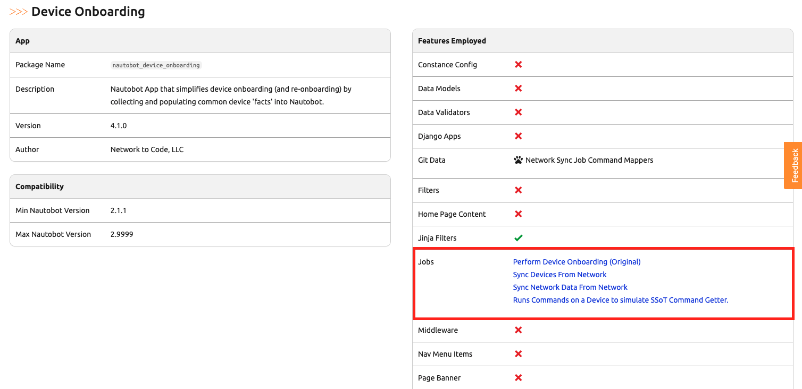
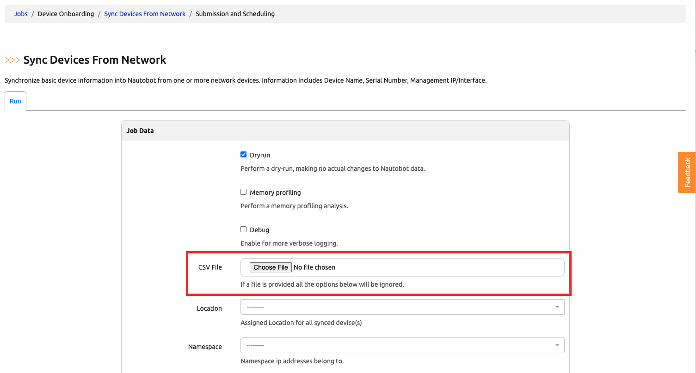
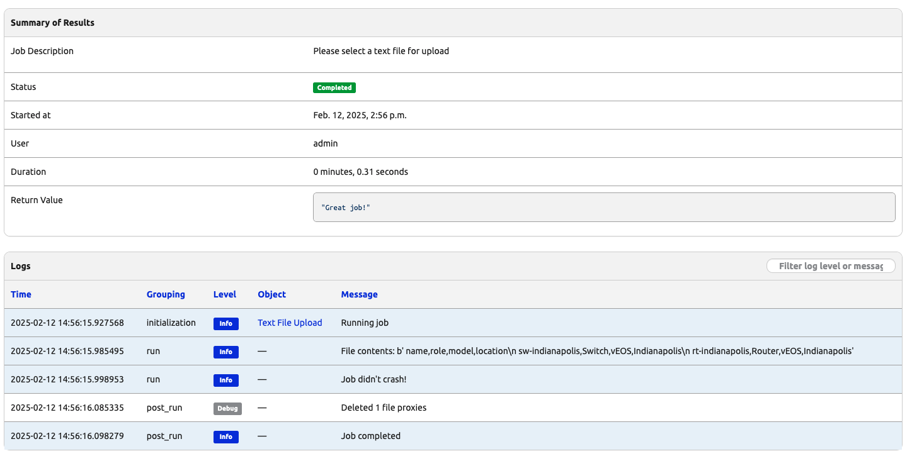

# Process Uploaded Files 

One way for the user to provide information to Nautobot, as we have seen in previous days, is to use HTML forms. This was how we were able to supply information such as IP address and location, for Nautobot Jobs. 

Another way to supply information in bulk is to use file uploads. This is particularly useful when we need to provide large amount of information that are somewhat similar that only differ slightly.

For example, we can take a look at the [Nautobot Device Onboarding App](https://docs.nautobot.com/projects/device-onboarding/en/latest/) as an example. This app aims to simplify the onboarding process of a new device into Nautobot. It does so by allowing the user to upload a CSV file containing the device IP address and location, which Nautobot will use to reach the device and onboard the device.





In today's challenge, we will allow the users to upload a custom file via the [FileVar](https://docs.nautobot.com/projects/core/en/v2.3.9/development/jobs/#filevar). 


## Environment Setup

The environment setup will be the same as [Lab Setup Scenario 1](../Lab_Setup/scenario_1_setup/README.md), below is a summary of the steps, please consult the guide for a detailed background if needed. 

If you had stopped and restarted Codespace instance, you can restart the instance and skip `invoke build` and `invoke db-import`: 

```
$ cd nautobot-docker-compose/
$ poetry shell
$ invoke debug
```

Otherwise, follow the same steps to start Nautobot in Codespace:

```
$ cd nautobot-docker-compose/
$ poetry shell
$ invoke build
$ invoke db-import
$ invoke debug
```

The environment is now setup for today's challenge.  

## Data File

Let's start by creating a simple file that we will use for our next examples. It is not uncommon that your organization has data in files or that exports files from other systems into a file. Usually, that data can be big and complicated, but we will start easily here. Later, we can always upload a bigger file. 

Let's create a text file with the CSV extension. CSV (Comma Separated Values) files are regular text files that you can open with your favorite text editor. This kind of files are used a lot to store data, we could use a different extension such as TXT but CSV will trigger some extra functionalities in some editors so let's use that.

File content:
```
name,role,model,location
sw-indianapolis,Switch,vEOS,Indianapolis
rt-indianapolis,Router,vEOS,Indianapolis
```

## File Upload Job

Let's create a new file named `file_upload.py` within the `jobs` directory and use it to allow the user to upload a text file, which we will read out the content.

The job is pretty straight forward with the following steps: 

1. Import `FileVAr` from `nautobot.apps.jobs`. 
2. Use the `read()` method to read the content of the file. 
3. Log the output. 

Let's take a look at the contents of `file_upload.py`.

```
from nautobot.apps.jobs import Job, register_jobs, FileVar

class FileUpload(Job):
    class Meta:
        name = "CSV File Upload"
        description = "Please select a CSV file for upload"

    file = FileVar(
        description="CSV File to upload",
    )

    def run(self, file):
        
        contents = str(file.read())
        self.logger.info(f"File contents: {contents}")
        self.logger.info(f"Job didn't crash!")

        return "Great job!"


register_jobs(
    FileUpload,
)
```

> [!TIP]
> Don't forget to perform `invoke post-upgrade` and enable the job in the GUI.

As you progress and create more complex jobs you will find that there is a wide range of predefined variables types that help you to create your job forms. You can check the current list of supported job variables in the following [link](https://docs.nautobot.com/projects/core/en/stable/development/jobs/?h=filevar#variables). 

In our particular case, we are using `FileVar`. This variable allows you to easily receive a file from the user and to pass that file to the `run()` method of the job.

Once we have created the job, let's go to the Job menu on Nautobot GUI and execute the job. Do not forget to enable the job first.

Here is the log of the job: 



Note that in the `post_run` the file was deleted. The file was loaded in memory and deleted after. 

## (Optional) File Checking

In our simple upload, we did not do any file type checking. In production, it would be better to perform some error checking to make sure the file is of the type we would expect. 

## Day 21 To Do

Remember to stop the codespace instance on [https://github.com/codespaces/](https://github.com/codespaces/). 

Go ahead and post a screenshot of the successful execution of the new job on a social media of your choice, make sure you use the tag `#100DaysOfNautobot` `#JobsToBeDone` and tag `@networktocode`, so we can share your progress! 

In tomorrow's challenge, we will build on this file and add a new job to process the CVS file and create objects in Nautobot based on the contents of the file. See you tomorrow!

[X/Twitter](<https://twitter.com/intent/tweet?url=https://github.com/nautobot/100-days-of-nautobot&text=I+jst+completed+Day+21+of+the+100+days+of+nautobot+!&hashtags=100DaysOfNautobot,JobsToBeDone>)

[LinkedIn](https://www.linkedin.com/) (Copy & Paste: I just completed Day 21 of 100 Days of Nautobot, https://github.com/nautobot/100-days-of-nautobot, challenge! @networktocode #JobsToBeDone #100DaysOfNautobot)
