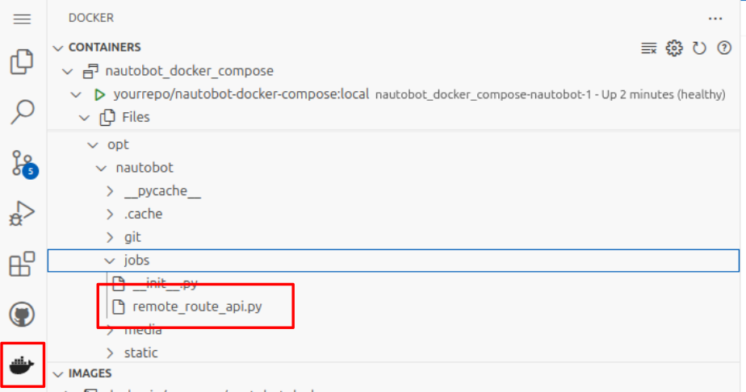
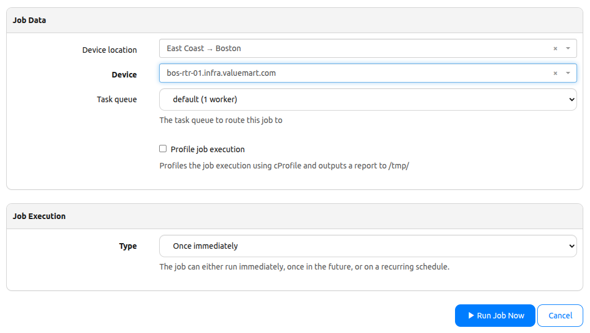
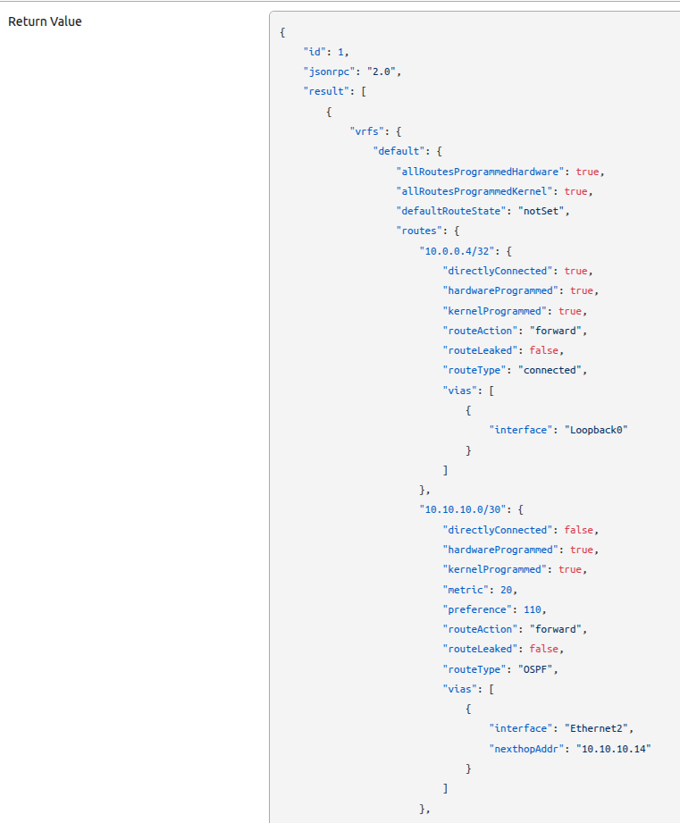
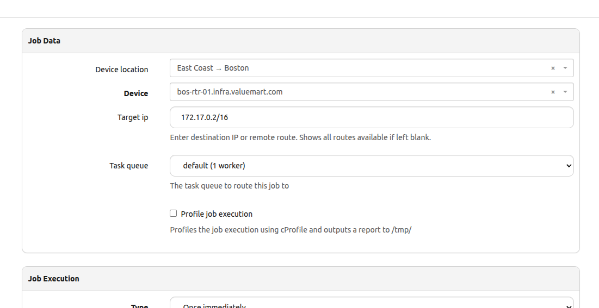
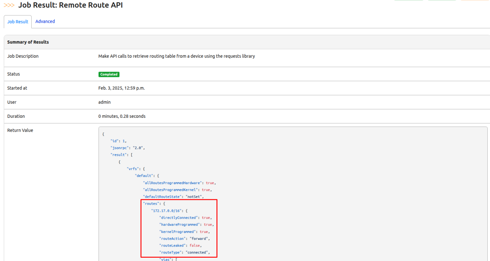
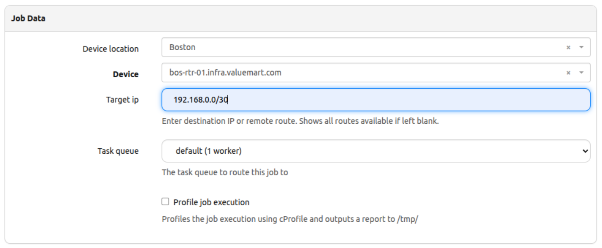
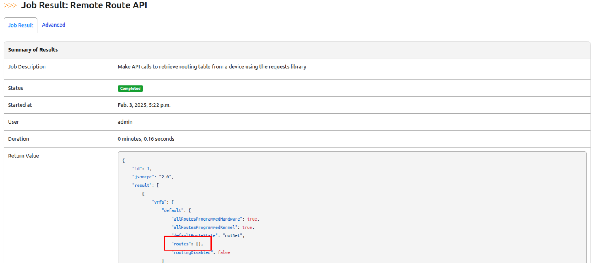

# API Calls to Devices to Validate External Routes

So far, we've touched on Application Programming Interface (API) in our previous challenges. Today, we'll continue to explore Nautobot's versatility by making API calls to external networking devices, allowing us to check if a remote route is in its routing table. 

For this challenge, we’ll be using the requests library, a powerful and user-friendly tool for making HTTP requests in Python. It makes interacting with APIs seamlessly, enabling us to send and receive data with ease. If you’re new to requests or want a deeper dive, check out [Requests: HTTP for Humans™](https://requests.readthedocs.io/en/latest/).

Let's get started with setting up our environment for today's challenge!

## Environment Setup

The environment setup is similar to [Lab Setup Scenario 1](../Lab_Setup/scenario_1_setup/README.md). Below is just a quick summary of the steps but please consult the guide if you'd like more details.

> [!NOTE]
> If you have stopped the Codespace environment and restart again but found the Docker daemon stopped working, please follow the steps in the setup guide to rebuild the environment.

```shell
$ cd nautobot-docker-compose/
$ poetry shell
$ invoke build
$ invoke db-import
$ invoke debug
```

> [!NOTE]
> If you are just restarting Codespace and Nautobot from previous days, you can skip ```invoke build``` and ```invokde db-import```.

We will also need our cEOS virtual lab for today's challenge. Below are the quick steps to deploy our topology but feel free to checkout [Day 9](../Day009_Python_Script_to_Jobs_Part_1/README.md) of the challenge if you need help with the virtual lab setup.

> [!TIP]
> This step is optional! So far we've been launching our Containerlab topology with just the Boston devices. If you want to test your job with more devices, try enabling the New York devices in the ceos-lab.clab.yml file. Just remember to add the IP addresses to the devices and assign the Primary IPs! If you need help with this, revisit [Day 10](../Day010_Python_Script_to_jobs_Part_2/README.md).

```yml
---
name: "ceos-lab"
prefix: ""

mgmt:
  # network: "network-lab"
  # ipv4-subnet: "172.24.78.0/24"
  network: "bridge"

topology:
  kinds:
    ceos:
      image: "ceos:4.32.0F"

  nodes:
    bos-acc-01:
      kind: "ceos"
      startup-config: "startup-configs/bos-acc-01.conf"

    bos-rtr-01:
      kind: "ceos"
      startup-config: "startup-configs/bos-rtr-01.conf"

    nyc-acc-01:
      kind: "ceos"
      startup-config: "startup-configs/nyc-acc-01.conf"

    nyc-rtr-01:
      kind: "ceos"
      startup-config: "startup-configs/nyc-rtr-01.conf"

  links:
    - endpoints: ["bos-acc-01:eth1", "bos-rtr-01:eth1"]
    - endpoints: ["bos-acc-01:eth2", "nyc-rtr-01:eth2"]
    - endpoints: ["bos-rtr-01:eth2", "nyc-acc-01:eth2"]
    - endpoints: ["nyc-acc-01:eth1", "nyc-rtr-01:eth1"]

```

Proceed here if you just want to work with Boston devices. 

```bash

➜ ~ $ docker import cEOS64-lab-4.32.0F.tar ceos:4.32.0F
➜ ~ $ cd 100-days-of-nautobot/clab/
➜ ~/100-days-of-nautobot/clab (main) $ sudo containerlab deploy --topo ceos-lab.clab.yml

```

🌟 Our environment is now ready for our next challenge! 🌟

## Walkthrough

First, we'll need to create the job file for today's challenge.

```bash

$ docker exec -u root -it nautobot_docker_compose-nautobot-1 bash
root@c9e0fa2a45a0:/opt/nautobot# cd jobs
root@c9e0fa2a45a0:/opt/nautobot/jobs# pwd
/opt/nautobot/jobs
root@c9e0fa2a45a0:/opt/nautobot/jobs# touch remote_route_api.py
root@c9e0fa2a45a0:/opt/nautobot/jobs# chown nautobot:nautobot remote_route_api.py

```

Once the file is created, head over to the Docker console on the left and open the file to make your changes.



We'll start by importing all the necessary modules for the job starting with ```Job```,```register_jobs```, and ```ObjectVar```. And since we want to determine remote routes for a specific device and location, we'll also import ```Device``` and ```Location``` to pull from our existing data models.

```python

import requests
from nautobot.apps.jobs import Job, ObjectVar, register_jobs
from nautobot.dcim.models import Device, Location

```

Next, we need to declare all of our variables and the meta class for our job descriptions.

```python

name = "API Requests"


class RemoteRouteAPI(Job):
    class Meta:
        name = "Remote Route API"
        has_sensitive_variables = False
        description = "Make API calls to retrieve routing table from a device using the requests library"

    # Define ObjectVars for device location and device selection
    device_location = ObjectVar(
        model=Location, 
        required=False
    )
    
    device = ObjectVar(
        model=Device,
        query_params={
            "location": "$device_location",
        },
    )

```

As we have learned so far, Nautobot relies on the ```run()``` method to execute the job -- passing device and its location as parameters. Also, within the ```run()``` method, we'll implement some logging and data validation to improve functionality before the job executes.

```python

    def run(self, device, device_location):
        self.logger.info(f"Checking all routes for {device.name}.")

        # Verify the device has a primary IP
        if device.primary_ip is None:
            self.logger.fatal(f"Device '{device.name}' does not have a primary IP address set.")
            return

        # Verify the device has a platform associated
        if device.platform is None:
            self.logger.fatal(f"Device '{device.name}' does not have a platform set.")
            return

```

If you're familiar with the ```request``` library, you know that we need a few basic elements to pass as part of the http(s) request when making an API call.  For the request to work, we'll need a few things:

1. API enpoint represented by ```url```.
2. The ```payload```, which contains the actual command. The data is structured based on the device requirements.
3. A valid ```auth``` or authorization credentials that allow us to remotely execute commands on a device. 

To validate remote routes on a networking device, we need to send the ```show ip route``` command (or equivalent based on the platform) in the payload.

> [!TIP]
> If you would like more information on to construct APIs, please visit [ARISTA](https://arista.my.site.com/AristaCommunity/s/article/arista-eapi-101?utm_source=chatgpt.com) and [CISCO](https://www.cisco.com/c/en/us/td/docs/routers/csr1000/software/restapi/restapi/RESTAPIipinterface.html?utm_source=chatgpt.com) documentation.
> [!NOTE]
> API calls may vary depending on the environment. For this lab, we will only need to send basic authorization and payload to the API endpoint.

```python

        # Construct the API URL using the device's primary IP address
        url = f"https://{str(device.primary_ip).split('/')[0]}/command-api"
        
        # Identify command based on device platform
        command_map = {
            "cisco_ios": "show ip route",
            "arista_eos": "show ip route",
            "juniper_junos": "show route"
        }
        
        platform_name = device.platform.network_driver
        cmd = command_map[platform_name]        
             
        # Define the payload for the API call based on device type
        payload = {
            "jsonrpc": "2.0",
            "method": "runCmds",
            "params": {
                "version": 1,
                "cmds": [cmd],  # Command must be passed as a list
                "format": "json"
            },
            "id": 1
        }

        # Set up basic authentication
        auth = ("admin", "admin")  # Update with actual credentials if needed

```

Now, to make the actual API call request using the ```request``` library.

Notice that we are using ```requests.post``` as the method for the request. Again, in some other instances or depending on the action, you may have to substitute with ```.get```, ```post```, ```put```, or ```delete``` for basic create, read, update, or delete functions (CRUD).

Finally, let's add some connection error handling to make sure we know if the device is reachable. This will help us catch any issues early and handle them gracefully! 

> [!IMPORTANT]
> Quick Reminder! 😊 After you finish writing your job, don’t forget the final step — register it using register_jobs() and then run ```invoke post-upgrade```.

```python

        # Make the API call
        try:
            response = requests.post(url, json=payload, auth=auth, verify=False) 
            response.raise_for_status()  # Raise an exception for HTTP errors

            # Parse the JSON response and show as log output
            route_data = response.json()
            self.logger.info(f"Routing table from {device.name}:\n{route_data}")

            return route_data  # You can modify this to return specific data if neededhe outcome of the API call.

        # Generate error mesages as both return value and log entry
        except requests.exceptions.RequestException as e:
            self.logger.fatal(f"Error connecting to {device.name}. Device unreachable.")
            raise Exception(f"Error connecting to {device.name}: {e}")

# Required step for Nautobot to recognize the job
register_jobs(
    RemoteRouteAPI
)

```

## Sample Code

At this point, our code should be similar to this::

```python

import requests
from nautobot.apps.jobs import Job, ObjectVar, register_jobs
from nautobot.dcim.models import Device, Location


name = "API Requests"


class RemoteRouteAPI(Job):
    class Meta:
        name = "Remote Route API"
        has_sensitive_variables = False
        description = "Make API calls to retrieve routing table from a device using the requests library"

    # Define ObjectVars for device location and device selection
    device_location = ObjectVar(
        model=Location, 
        required=False
    )
    
    device = ObjectVar(
        model=Device,
        query_params={
            "location": "$device_location",
        },
    )

    def run(self, device_location, device):
        self.logger.info(f"Checking all routes for {device.name}.")

        # Verify the device has a primary IP
        if device.primary_ip is None:
            self.logger.fatal(f"Device '{device.name}' does not have a primary IP address set.")
            return

        # Verify the device has a platform associated
        if device.platform is None:
            self.logger.fatal(f"Device '{device.name}' does not have a platform set.")
            return

        # Construct the API URL 
        url = f"https://{str(device.primary_ip).split('/')[0]}/command-api"
        
        # identify command based on device platform
        command_map = {
            "cisco_ios": "show ip route",
            "arista_eos": "show ip route",
            "juniper_junos": "show route"
        }
        
        platform_name = device.platform.network_driver
        cmd = command_map[platform_name]        
             
        # Define the payload for the API call based on device type
        payload = {
            "jsonrpc": "2.0",
            "method": "runCmds",
            "params": {
                "version": 1,
                "cmds": [cmd],  # Command must be passed as a list
                "format": "json"
            },
            "id": 1
        }

        # Set up basic authentication
        auth = ("admin", "admin")  # Update with actual credentials if needed

        # Make the API call
        try:
            response = requests.post(url, json=payload, auth=auth, verify=False) 
            response.raise_for_status()  # Raise an exception for HTTP errors

            # Parse the JSON response and show as log output
            route_data = response.json()
            self.logger.info(f"Routing table from {device.name}:\n{route_data}")

            return route_data  # You can modify this to return specific data if needed

        # Generate error mesages as both return value and log entry
        except requests.exceptions.RequestException as e:
            self.logger.fatal(f"Error connecting to {device.name}. Device unreachable.")
            raise Exception(f"Error connecting to {device.name}: {e}")


# Required step for Nautobot to recognize the job
register_jobs(
    RemoteRouteAPI
)

```
We are now ready to run the job! 🚀



And here is the result!



Awesome! So far, we've successfully connected to the remote device, sent an API call with the correct payload, and retrieve the data from it's routing table.

But, as Network Engineers, we often need to check if a specific IP address or route exists in a device's routing table — this super helpful when troubleshooting, among other tasks. So, how do we add a target IP address or subnet as an input to our job?

To make this work, we need to tweak our code a bit!

✅ First, we’ll add StringVar to our import statements.

✅ Next, we’ll use StingVar to introduce an input variable to capture the specific target IP or subnet.

✅ Then we'll modify our payload to add the target IP to our API payload (if provided).

✅ Finally, we’ll update our log statements to make the output more user-friendly and informative.

Let’s dive in!

```python
...
# Add StringVar to import statements
from nautobot.apps.jobs import Job, ObjectVar, StringVar, register_jobs


    ...
    # Asks user for destination ip
    target_ip = StringVar(
        description = "Enter destination IP or remote route. Shows all routes available if left blank.", 
        required = False
    )

    ...
    # Log statements captures if the job is for a specific route or for all routes
    def run(self, device_location, device, target_ip):
        if target_ip:
            self.logger.info(f"Checking if {device.name} has a route to {target_ip}.")
        else:
            self.logger.info(f"Checking all routes for {device.name}.")
```

> [!NOTE]
> Notice that we set the target_ip to ```required = False``` to allow for flexibility. This way, the job will run whether the user specifies a particular route or leaves the field blank.

To modify our payload, we just need to simply add an if/else statement. If a target ip address is provided, our code will append it to the base command of ```show ip route```. If the field is left blank, then only the base command is sent to the device.

```python

        ...        
        base_cmd = command_map.get(platform_name) 

        # Append target IP to the command "show ip route" if provided
        if target_ip:
            cmd = f"{base_cmd} {target_ip}"
        else:
            cmd = base_cmd
             
        # Construct the payload for the API call based on device type
        payload = {
            "jsonrpc": "2.0",
            "method": "runCmds",
            "params": {
                "version": 1,
                "cmds": [cmd],  # Command must be a list
                "format": "json"
            },
            "id": 1
        }    

```

The final code with all the modifications should look like this:

```python


import requests
from nautobot.apps.jobs import Job, ObjectVar, StringVar, register_jobs
from nautobot.dcim.models import Device, Location


name = "API Requests"


class RemoteRouteAPI(Job):
    class Meta:
        name = "Remote Route API"
        has_sensitive_variables = False
        description = "Make API calls to retrieve routing table from a device using the requests library"

    # Define ObjectVars for device location and device selection
    device_location = ObjectVar(
        model=Location, 
        required=False
    )
    
    device = ObjectVar(
        model=Device,
        query_params={
            "location": "$device_location",
        },
    )

    target_ip = StringVar(
        description = "Enter destination IP or remote route. Shows all routes available if left blank.", 
        required = False
    )

    def run(self, device_location, device, target_ip):
        if target_ip:
            self.logger.info(f"Checking if {device.name} has a route to {target_ip}.")
        else:
            self.logger.info(f"Checking all routes for {device.name}.")

        # Verify the device has a primary IP
        if device.primary_ip is None:
            self.logger.fatal(f"Device '{device.name}' does not have a primary IP address set.")
            return

        # Verify the device has a platform associated
        if device.platform is None:
            self.logger.fatal(f"Device '{device.name}' does not have a platform set.")
            return

        # Construct the API URL 
        url = f"https://{str(device.primary_ip).split('/')[0]}/command-api"
        
        # Identify command based on device platform
        command_map = {
            "cisco_ios": "show ip route",
            "arista_eos": "show ip route",
            "juniper_junos": "show route"
        }
        
        platform_name = device.platform.network_driver
        base_cmd = command_map.get(platform_name)

        # Append target IP to the command "show ip route" if provided
        if target_ip:
            cmd = f"{base_cmd} {target_ip}"
        else:
            cmd = base_cmd
             
        # Construct the payload for the API call based on device type
        payload = {
            "jsonrpc": "2.0",
            "method": "runCmds",
            "params": {
                "version": 1,
                "cmds": [cmd],  # Command must be a list
                "format": "json"
            },
            "id": 1
        }    
        
        # Set up basic authentication
        auth = ("admin", "admin")  # Update with actual credentials if needed

        # Make the API call
        try:
            response = requests.post(url, json=payload, auth=auth, verify=False) 
            response.raise_for_status()  # Raise an exception for HTTP errors

            # Parse the JSON response and show as log output
            route_data = response.json()
            self.logger.info(f"Routing table from {device.name}:\n{route_data}")

            return route_data  # You can modify this to return specific data if needed

        # Generate error mesages as both return value and log entry
        except requests.exceptions.RequestException as e:
            self.logger.fatal(f"Error connecting to {device.name}. Device unreachable.")
            raise Exception(f"Error connecting to {device.name}: {e}")


# Required step for Nautobot to recognize the job
register_jobs(
    RemoteRouteAPI
)

```

Let's launch our newly modified job! 🚀



You should see a route for the desination (or something similar) under ```{routes}``` if the target is in the routing table.



What should we expect if a route does not exist? Let's run the job for a destination that does not exist and see what the output is.



We should see empty ```{routes}``` if the destination is not in the routing table.



## Additional Challenge

As an extra challenge, why not experiment with the code to return different pieces of information? Since the data we receive is in JSON format, try modifying the logic to parse through the data and pull out specific items of interest. For example, you could check whether certain routes exist and return a boolean value indicating their presence.

## Day 31 To Do

Remember to stop the codespace instance on [https://github.com/codespaces/](https://github.com/codespaces/).

Go ahead and post a screenshot of the successful execution of the new job on a social media of your choice. Let us know how you changed the code to meet your other needs! Make sure you use the tags `#100DaysOfNautobot` and `#JobsToBeDone` and be sure to tag `@networktocode` so we can share your progress!

For the next challenge, we'll execute more API calls to retrieve Common Vulnerabilities and Exposures from devices. See you tomorrow!

[LinkedIn](https://www.linkedin.com/)

[X/Twitter](https://x.com/home)
