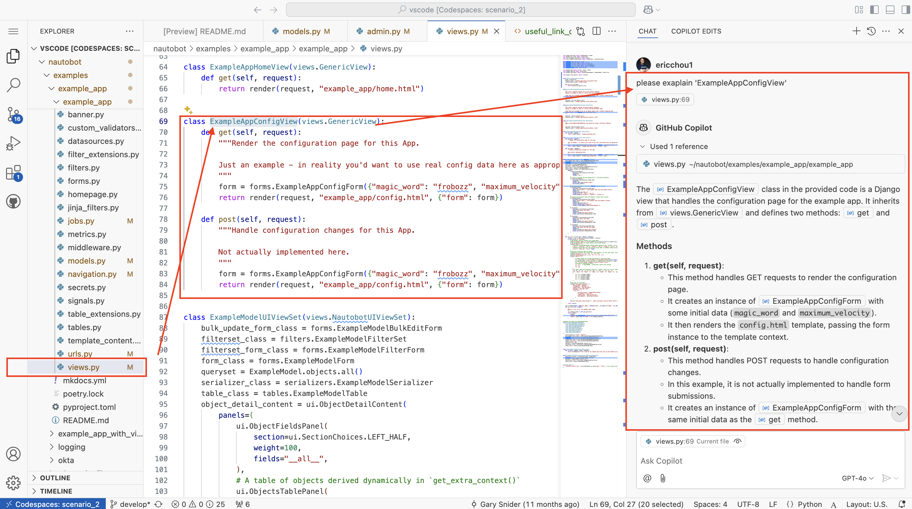
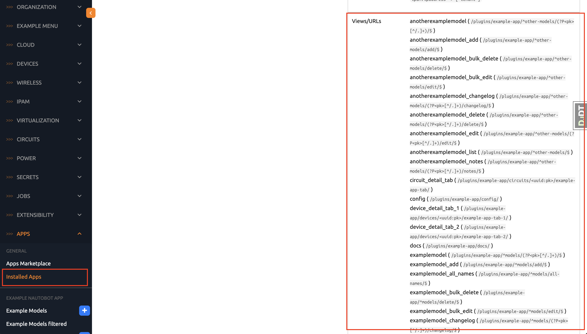
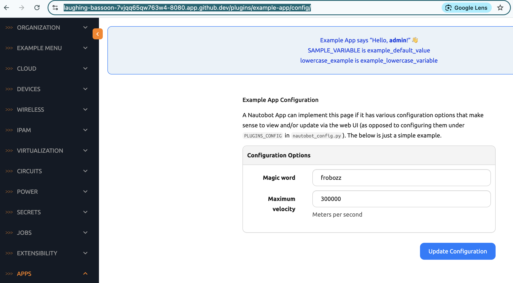

# Example App Creating New Views - Part 1

In Day 52, we created a new data model `UsefulLinks` and populated with some data. In this next part of the challenge, we will create a view that ties the data model with the template we will display to the user.  

But first, let's look at the existing code for example_app views. 

## Existing Code Example

Since the example_app is meant for providing examples in app development, the `views.py` file has lots of comments meant to help us with understanding the code. 

Again, if you have GitHub Copilot, I find them doing a decent job in explaining the code. For example, I highlighted `ExampleAppConfigView` and ask it to explain: 



Some views can be complex with extra context, actions, overrides, etc. But other views can be straight forward, such as the `CircuitDetailAppTabView` and `DeviceDetailAppTabOneView` that simply provides a list of objects it will pass in a response and point to the particular HTML template: 

```python views.py
class CircuitDetailAppTabView(views.ObjectView):
    """
    This view's template extends the circuit detail template,
    making it suitable to show as a tab on the circuit detail page.

    Views that are intended to be for an object detail tab's content rendering must
    always inherit from nautobot.apps.views.ObjectView.
    """

    queryset = Circuit.objects.all()
    template_name = "example_app/tab_circuit_detail.html"


class DeviceDetailAppTabOneView(views.ObjectView):
    """
    This view's template extends the device detail template,
    making it suitable to show as a tab on the device detail page.

    Views that are intended to be for an object detail tab's content rendering must
    always inherit from nautobot.apps.views.ObjectView.
    """

    queryset = Device.objects.all()
    template_name = "example_app/tab_device_detail_1.html"
```

I have a feeling for our simple `UsefulLinks` table, we do not need anything complicated. 

Again, take a look at the `Example Nautobot App` page `Views/URLs` section:  



Then try out a few of the urls and try to correlate the view, the models, and the HTML template: 



As with the saying, "measure twice, cut once," the time we spent in studying current code base pays dividend down the line for building our understanding. 

Come back tomorrow, we will create our own views! 

## Day 53 To Do

Remember to stop the codespace instance on [https://github.com/codespaces/](https://github.com/codespaces/). 

Go ahead and post a screenshot of the URL/View/Template you discovered outside of what we mentioned in today's challenge on a social media of your choice, make sure you use the tag `#100DaysOfNautobot` `#JobsToBeDone` and tag `@networktocode`, so we can share your progress! 

In tomorrow's challenge, we will be creating a view for our data model. See you tomorrow! 

[X/Twitter](<https://twitter.com/intent/tweet?url=https://github.com/nautobot/100-days-of-nautobot&text=I+just+completed+Day+53+of+the+100+days+of+nautobot+challenge+!&hashtags=100DaysOfNautobot,JobsToBeDone>)

[LinkedIn](https://www.linkedin.com/) (Copy & Paste: I just completed Day 53 of 100 Days of Nautobot, https://github.com/nautobot/100-days-of-nautobot-challenge, challenge! @networktocode #JobsToBeDone #100DaysOfNautobot) 