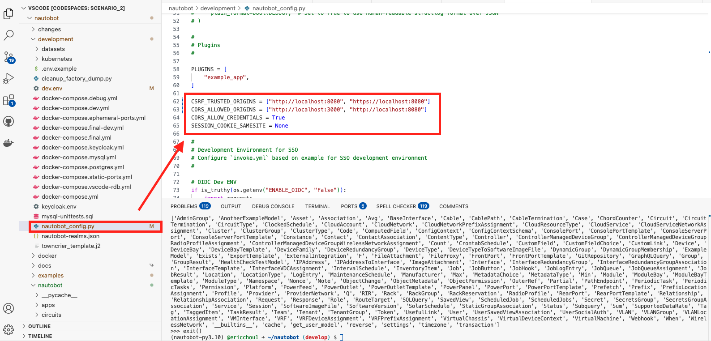

# Nautobot Database Model Part 3: Data Integrity and Security

Data integrity and security are two areas we will focus on for today's challenge.

We want to make sure data in our databases remain accurate, consistent, and reliable. In Nautobot, we can do this by enforcing the fields with constraints, validation, and certain relationships between models.

Security in Nautobot involves protecting data from unauthorized access, ensuring data confidentiality, integrity, and availability.

## Environment Setup

For today's challenge, we will use:

- [Scenario 2](../Lab_Setup/scenario_2_setup/README.md) lab for hands-on practice.
- [https://demo.nautobot.com/](https://demo.nautobot.com/) for a live demo environment.
- [Nautobot Documentation](https://docs.nautobot.com/projects/core/en/latest/user-guide/core-data-model/overview/introduction/) as a reference guide.


## Data Integrity 

Data integrity ensures that the information in your database remains accurate, consistent, and reliable. Here are the key concepts and practices that Nautobot uses to maintain integrity:

### 1. **Field Constraints**
Field constraints enforce rules at the individual field level to ensure valid data. Examples include:
- `max_length` for specifying the maximum number of characters in a `CharField`.
- `unique=True` for fields that must have unique values (e.g., serial numbers).
- `null=True` for fields that can be left empty.

---

### 2. **Model Validation**
Custom validation methods within models allow you to enforce complex validation rules that go beyond basic field constraints. These methods help ensure that your data adheres to business logic and organizational requirements.

---

### 3. **Database Relationships**
Database relationships maintain referential integrity between models. Examples include:
- **`ForeignKey`**: Links one record to another in a different model (e.g., associating an `Asset` with a `Device`).
- **`OneToOneField`**: Ensures a unique, one-to-one relationship between records.
- **`ManyToManyField`**: Links multiple records from one model to multiple records in another.

The `on_delete` parameter in `ForeignKey` ensures that related data is handled appropriately when a referenced object is deleted. For example:
- `on_delete=models.CASCADE`: Deletes the related object and all associated records.
- `on_delete=models.SET_NULL`: Sets the related field to `NULL` if the referenced object is deleted.

---


### Example: Asset Model with Integrity Features
Here is a practical example of these concepts in action Looking back at [Day 62](../Day062_Database_Models_2_Custom_Models/README.md) custom models, we created the following code related to the data integrity concepts: 

```python
class Asset(models.Model):
    device = models.ForeignKey(Device, on_delete=models.CASCADE)
    serial_number = models.CharField(max_length=100, unique=True)
    purchase_date = models.DateField()
    warranty_expiration = models.DateField()

    def __str__(self):
        return f"Asset {self.serial_number} for {self.device}"
```

The `Asset` model enforces:
- Referencing a `Device` with a `ForeignKey` and `on_delete=models.CASCADE`.
- Unique serial numbers for each asset.
- Proper date fields for `purchase_date` and `warranty_expiration`.

---

## Security 


Database security in Nautobot focuses on protecting data from unauthorized access and ensuring data confidentiality, integrity, and availability. Here are the key security measures:

### 1. **Authentication and Authorization**
- Use Django's built-in authentication system to manage user access.
- Define **user roles** and **permissions** to control who can view or modify data.
- Leverage Nautobot's [object permissions](https://docs.nautobot.com/projects/core/en/stable/user-guide/platform-functionality/users/objectpermission/) to restrict access to sensitive fields.

---

### 2. **Field-Level Security**
Object-level permissions can be applied in Nautobot to limit access to specific fields or objects. This ensures that sensitive data is only accessible to authorized users.

---

### 3. **Audit Logging**
Enable audit logging to track changes made to the database. This provides a clear record of who made changes, what changes were made, and when they occurred. Audit logs are essential for:
- Monitoring unauthorized changes.
- Complying with regulatory requirements.

---

### 4. **Secure Configuration**
Many security settings are configured in the `nautobot_config.py` file. While development environments may relax some security settings, ensure production environments:
- Use strong passwords and API keys.
- Enforce HTTPS.
- Define proper CORS and CSRF settings.
- Restrict sensitive data visibility to authenticated users.

Example of `nautobot_config.py` settings:


---

Congratulations on completing Day 63! 

## Day 63 To Do

Remember to stop the codespace instance on [https://github.com/codespaces/](https://github.com/codespaces/). 

Go ahead and post your thought on data integrity and security in Nautobot from today's challenge on a social media of your choice, make sure you use the tag `#100DaysOfNautobot` `#JobsToBeDone` and tag `@networktocode`, so we can share your progress! 

In tomorrow's challenge, we will discuss database migration. See you tomorrow! 

[X/Twitter](<https://twitter.com/intent/tweet?url=https://github.com/nautobot/100-days-of-nautobot&text=I+just+completed+Day+60+of+the+100+days+of+nautobot+challenge+!&hashtags=100DaysOfNautobot,JobsToBeDone>)

[LinkedIn](https://www.linkedin.com/) (Copy & Paste: I just completed Day 60 of 100 Days of Nautobot, https://github.com/nautobot/100-days-of-nautobot-challenge, challenge! @networktocode #JobsToBeDone #100DaysOfNautobot) 