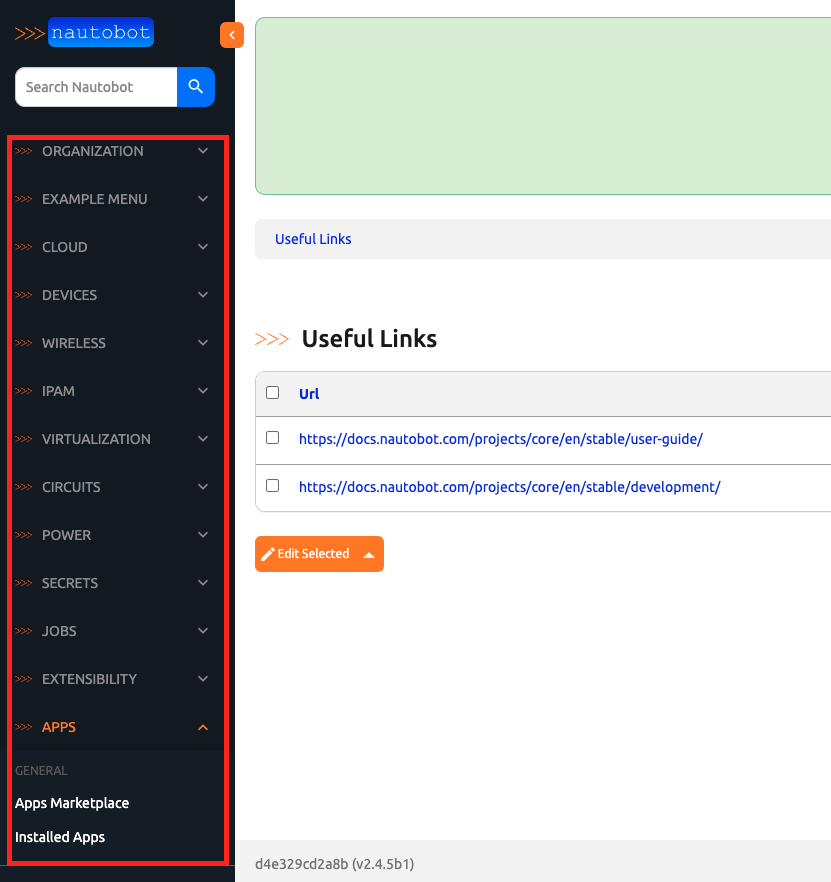
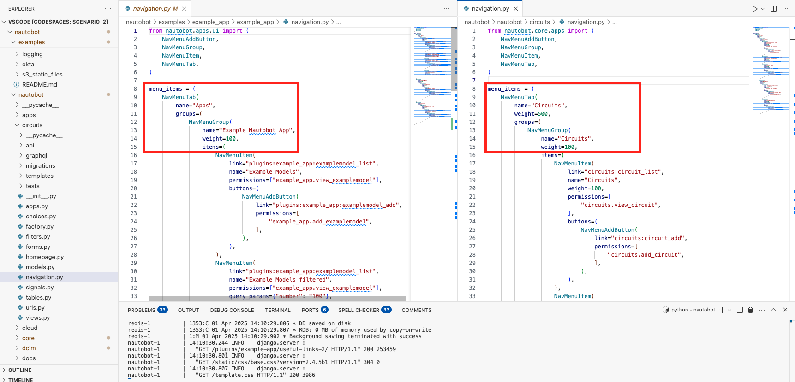
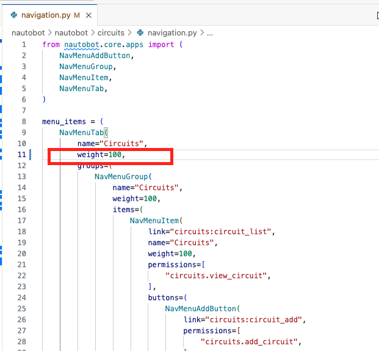
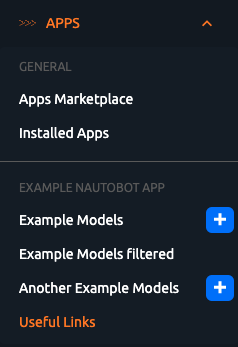

# Nautobot Navigation

In [Day 57](https://github.com/nautobot/100-days-of-nautobot/blob/main/Day057_Example_App_Creating_Navigation/README.md), we saw how we can add a navigation menu item for a view. 

In today's challenge, we will learn more about the navigation menu. In particular, how to populate, modify, and add to the navigation menu. 

We will reference the concepts as explained in the core and app developer documentation:  

- [Populating the Navigation Menu](https://docs.nautobot.com/projects/core/en/stable/development/core/navigation-menu/)
- [Adding Navigation Menu Items](https://docs.nautobot.com/projects/core/en/stable/development/apps/api/ui-extensions/navigation/)

Let's get started. 

## Environment Setup

We will use a combination of [Scenario 2](../Lab_Setup/scenario_2_setup/README.md) lab, [https://demo.nautobot.com/](https://demo.nautobot.com/), and [Nautobot Documentation](https://docs.nautobot.com/projects/core/en/latest/user-guide/core-data-model/overview/introduction/) for today's challenge. 


## NavMenuTab and NavMenuGroup in Nautobot

`NavMenuTab` and `NavMenuGroup` classes are used to organize the navigation menu in Nautobot. Tabs represent the top-level navigation elements, while groups represent collections of items within a tab.

1. **NavMenuTab Class**: Represents a top-level navigation tab.
2. **NavMenuGroup Class**: Represents a group of items within a navigation tab.
3. **NavMenuItem Class**: Represents individual items within a navigation group.
4. **Registry**: Used to register `NavMenuTab`, `NavMenuGroup`, and `NavMenuItem` instances.

For comparison, we can see the hierarchical differences between the `circuits` app and the `example_app` in the navigation: 



If we compare the `navigations.py` file between `circuits` and `example_app`, we can see `circuits` has its own `NavMenuTab` while `example_app` links are under a `APPs` `NavMenuTab` section: 



## Weights

The main way to define the position the objects to be displayed is to use the `weight` attribute. 

For example, we can change the `weight` for `circuits` from `500` to `100` (lower value means higher priority): 



The `circuits` object is now listed at the top: 


The same can be done within `NavMenuItems`. For example, we can change the `example_app` `Useful Links` menu item to weight `500` while all the other menu items to `100`: 


The corresponding order would list `Useful Links` below other objects: 



## Adding New NavMenuTab

Let's see how we can add a `NavMenuTab` item. We can append the following code at the end of the `navigations.py` `menu_items` list: 


```python 
    NavMenuTab(
        name="100 Days of Nautobot Tab",
        groups=(
            NavMenuGroup(
                name="100 Days of Nautobot Group",
                weight=150,
                items=(
                    NavMenuItem(
                        link="plugins:example_app:examplemodel_list",
                        name="100 Days of Nautobot Model",
                        permissions=["example_app.view_examplemodel"],
                        buttons=(
                            NavMenuAddButton(
                                link="plugins:example_app:examplemodel_add",
                                permissions=[
                                    "example_app.add_examplemodel",
                                ],
                            ),
                        ),
                    ),
                ),
            ),
        ),
    ),
```

We will see there is the new `NavMenuTab` object and its associated `NavMenuGroup` and `NavMenuItem`: 


Navigation menu is straight forward in its usage, but sometimes it takes a bit of practice to get things appear the way you would like them to be. 

Congratulations on completing Day 75! 

## Resources
- [Populating the Navigation Menu](https://docs.nautobot.com/projects/core/en/stable/development/core/navigation-menu/)
- [Adding Navigation Menu Items](https://docs.nautobot.com/projects/core/en/stable/development/apps/api/ui-extensions/navigation/)


## Day 75 To Do

Remember to stop the codespace instance on [https://github.com/codespaces/](https://github.com/codespaces/). 

Go ahead and post a screenshot of the new navigation menu that you created for today's challenge on a social media of your choice, make sure you use the tag `#100DaysOfNautobot` `#JobsToBeDone` and tag `@networktocode`, so we can share your progress! 

In tomorrow's challenge, we will be taking another look at URL dispatch. See you tomorrow! 

[X/Twitter](<https://twitter.com/intent/tweet?url=https://github.com/nautobot/100-days-of-nautobot&text=I+just+completed+Day+75+of+the+100+days+of+nautobot+challenge+!&hashtags=100DaysOfNautobot,JobsToBeDone>)

[LinkedIn](https://www.linkedin.com/) (Copy & Paste: I just completed Day 75 of 100 Days of Nautobot, https://github.com/nautobot/100-days-of-nautobot-challenge, challenge! @networktocode #JobsToBeDone #100DaysOfNautobot) 