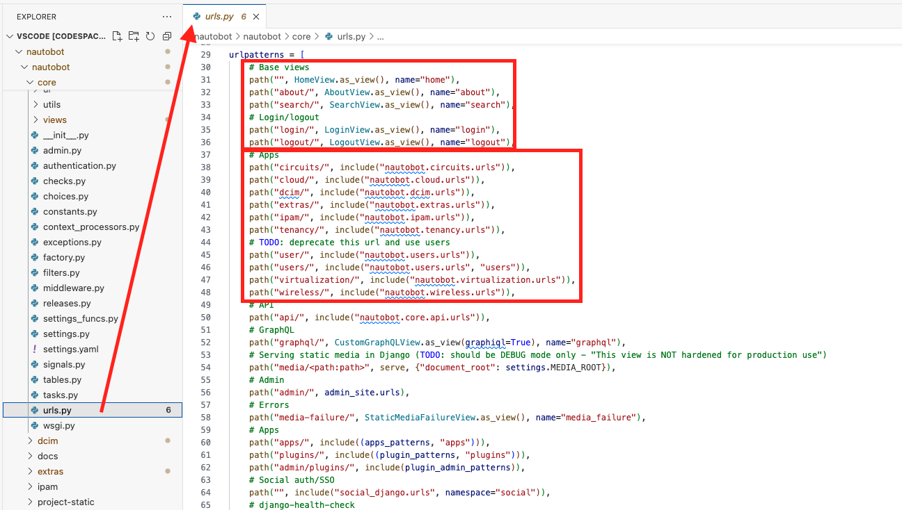
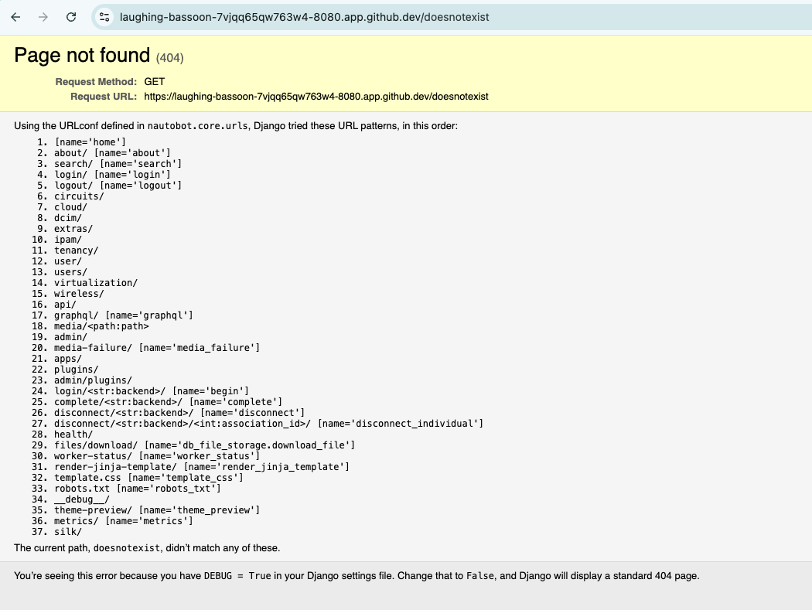
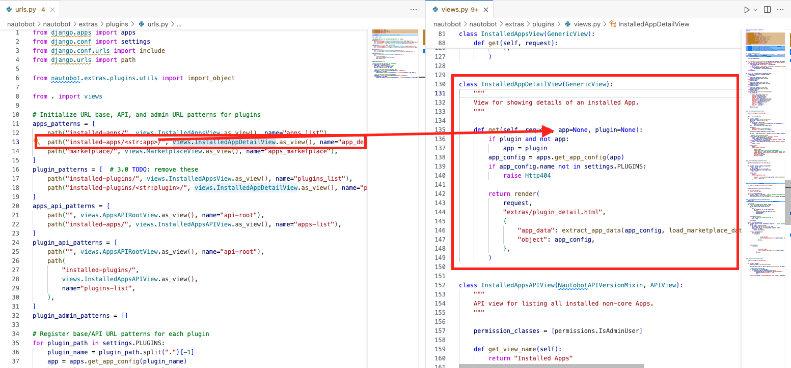

# URL Dispatch for URL Patterns

In today's challenge, we will dive deeper into understanding the configuration of URL patterns and the associated dispatch of views in Nautobot.

## Environment Setup

We will use a combination of [Scenario 2](../Lab_Setup/scenario_2_setup/README.md) lab, [https://demo.nautobot.com/](https://demo.nautobot.com/), and [Nautobot Documentation](https://docs.nautobot.com/projects/core/en/latest/user-guide/core-data-model/overview/introduction/) for today's challenge. 

## URL Patterns

URL patterns in Django, and consequently in Nautobot, are used to map URLs to views. This allows the application to respond to different URLs with appropriate views and actions. 

We already had some experience with the pattern. Recall in `Day 56` and in `Day 67` we configured various URL patterns at the app level: 

- [Day 56. Example App Create New URL Routing](https://github.com/nautobot/100-days-of-nautobot/blob/main/Day056_Example_App_Creating_New_URL_Routing/README.md)
- [Day 67. Nautobot Views 2 Nautobot UI ViewSet](../Day067_Nautobot_Views_2_Nautobot_UI_ViewSet/README.md)

## URL Dispatcher 

The URL dispatcher in Django uses regular expressions to match the requested URL to a set of patterns defined in the `urls.py` file.

**Key components:**

1. **URLconf Module**: A module that contains the URL-to-view mappings, this is typically `urls.py`. 
2. **Path Function**: A function used to define URL patterns. 
3. **Include Function**: A function used to include other URL patterns, if we need to pass it to other `urls.py` file. 
4. **Views**: Functions or classes that handle the request and return a response, if we return the views directly. 

Let's take a look at the top level `nautobot -> core -> urls.py`: 

- For path such as `""` (empty), `about/`, `search/` and others, the code returns a view directly. 
- For path such as `circuits/`, `cloud/`, `dcim/` the code uses `include()` to pass them to other `urls.py` file in the apps. 



But wait a minute, what about the `example_app` that we saw? Instead of reference a file, the code imports lists and referenced the list in the `include()` function: 

```python
...
from nautobot.extras.plugins.urls import (
    apps_patterns,
    plugin_admin_patterns,
    plugin_patterns,
)
...
urlpatterns = [
    ...
    # Apps
    path("apps/", include((apps_patterns, "apps"))),
    path("plugins/", include((plugin_patterns, "plugins"))),
    ...
]
```

Because `debug` is set to be `true` in our environment, if there is a URL that does not match, we will see an error page that helps us see the order of matching preference: 



As stated on the page, the URL search pattern is searched in an order of preference. If you would like to learn more about how Django processes a request URL pattern, more information can be found on [URL dispatcher](https://docs.djangoproject.com/en/5.1/topics/http/urls/). 

## URL Name Reference

You might be wondering what the `name` parameters in the `path()` function are. The "name" parameter in the path() function serves several important purposes:

1. URL Reversing:

    - The "name" parameter allows you to create a unique identifier for a specific URL pattern.
    - This identifier can be used with Django's `reverse()` function or `` template tag to dynamically generate URLs based on the view name rather than hard coding the URL paths.

2. URL Namespacing:

    - Naming URL patterns helps to avoid conflicts in large projects with multiple apps by providing a way to namespace URLs.
    - This is particularly useful when including URLs from different apps.

3. Template Usage:

    - In Django templates, you can use the `` template tag along with the URL name to generate URLs.

## Path Converter

The URL pattern might include expressions such as `<str:app>` or `<str:plugin>`. They are called "path converters" and capture keyword arguments to the view. They follow the syntax of `<converter:name>` where `converter` specifies a data type and `name` is the variable name. 

Let us look at `nautobot -> extras -> plugins -> urls.py` as an example: 

```python 
...
path("installed-apps/<str:app>/", views.InstalledAppDetailView.as_view(), name="app_detail")
...
path("installed-plugins/<str:plugin>/", views.InstalledAppDetailView.as_view(), name="plugin_detail"),
...
```

The `<str:app>` means we are passing a `str` variable named `app` to the `InstalledAppDetailView`: 



This allows us to be flexible on the variable passing in without hard code every single pattern. 

That is it for now for URL dispatching. Congratulations on completing Day 76!

## Day 76 To Do

Remember to stop the codespace instance on [https://github.com/codespaces/](https://github.com/codespaces/). 

Go ahead and post a screenshot of the URL patterns we looked at in today's challenge on a social media of your choice, make sure you use the tag `#100DaysOfNautobot` `#JobsToBeDone` and tag `@networktocode`, so we can share your progress! 

In tomorrow's challenge, we will Nautobot forms. See you tomorrow! 

[X/Twitter](<https://twitter.com/intent/tweet?url=https://github.com/nautobot/100-days-of-nautobot&text=I+just+completed+Day+76+of+the+100+days+of+nautobot+challenge+!&hashtags=100DaysOfNautobot,JobsToBeDone>)

[LinkedIn](https://www.linkedin.com/) (Copy & Paste: I just completed Day 76 of 100 Days of Nautobot, https://github.com/nautobot/100-days-of-nautobot-challenge, challenge! @networktocode #JobsToBeDone #100DaysOfNautobot) 