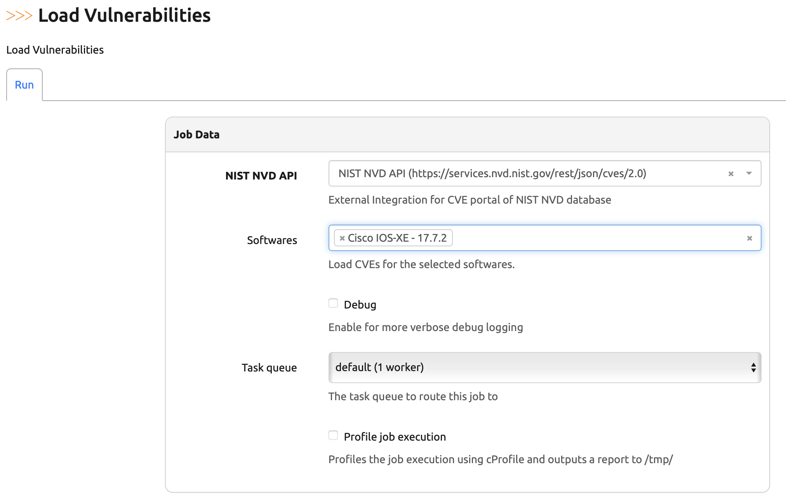
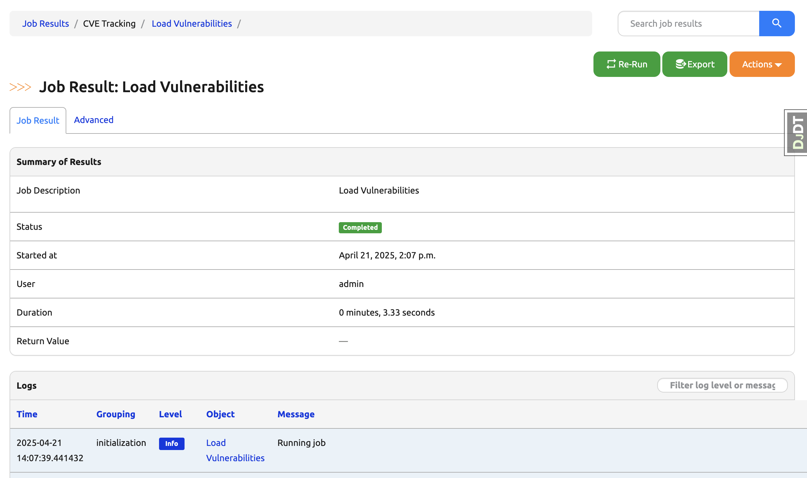
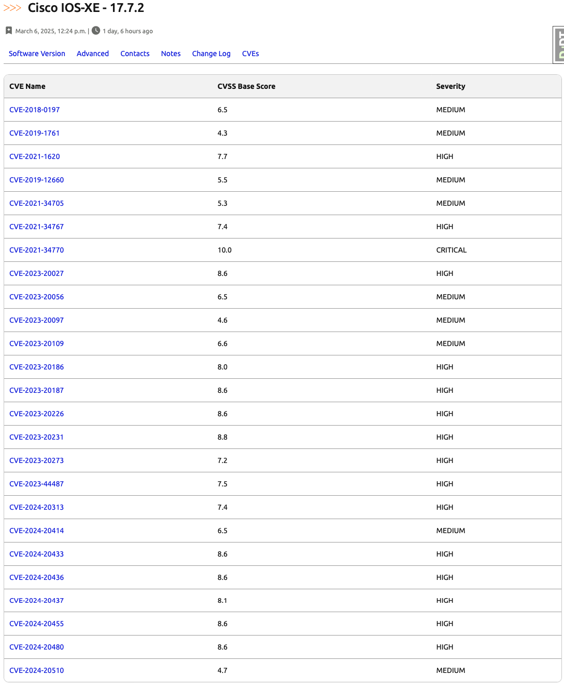

# Capstone Project Part 10. Day 89: Integrating a CVE Loader Job into Nautobot via Plugin

## **Objective**
On **Day 89**, we will build on the external integration with NIST NVD from Day 88 and show how to:

1. **Integrate a Job into Nautobot** via a plugin.
2. **Develop a Job** that retrieves CVEs for selected Software Versions using the NIST NVD API.
3. **Run the Job** to get the CVEs for a specific software version (`Cisco IOS XE 17.7.2`).
4. **Verify the Results** in the Nautobot UI.

## Environment Setup

For the Capstone for Days 80 - 89, we will use [Scenario 2](../Lab_Setup/scenario_2_setup/README.md) lab with Codespace as we have been doing. 

Assume we built on previous day's progress, we need to enable the virtual environment with `poetry shell` and start the environment with `invoke debug`: 

```
@ericchou1 ➜ ~ $ cd nautobot-app-software-cves/
@ericchou1 ➜ ~/nautobot-app-software-cves $ poetry shell
(nautobot-software-cves-py3.10) @ericchou1 ➜ ~/nautobot-app-software-cves $ invoke debug
...
nautobot-1  | Django version 4.2.20, using settings 'nautobot_config'
nautobot-1  | Starting development server at http://0.0.0.0:8080/
nautobot-1  | Quit the server with CONTROL-C.
...
```

## **Implementation Steps**

### **1. Define a Job in `jobs.py`**

Inside your Nautobot plugin folder (`nautobot_software_cves/`), create a file named `jobs.py`. This is where we will define the CVE loader job. Remember to do ```invoke post-upgrade```.

```python
""" 
Module for managing CVEs in Nautobot using NIST NVD API.

This module defines a job for loading CVEs into Nautobot\'s database.
"""

import requests

from nautobot.apps.jobs import BooleanVar, Job, ObjectVar, MultiObjectVar, register_jobs
from nautobot.extras.models import ExternalIntegration
from nautobot.dcim.models.devices import SoftwareVersion, SoftwareVersionQuerySet

name = "CVE Tracking"


class LoadCVEsJob(Job):
    nist_external_integration = ObjectVar(
        model=ExternalIntegration,
        label="NIST NVD API",
        description="External Integration for CVE portal of NIST NVD database",
        required=True,
    )
    softwares = MultiObjectVar(
        model=SoftwareVersion,
        label="Softwares",
        description="Load CVEs for the selected softwares.",
        required=False
    )
    debug = BooleanVar(description="Enable for more verbose debug logging")

    class Meta:
        """Meta object for Device State Diff - Compare Data Job."""

        name = "Load Vulnerabilities"
        description = "Load Vulnerabilities"
        has_sensitive_variables = False
        hidden = False

    def run(
        self,
        nist_external_integration: ExternalIntegration = None,
        softwares: SoftwareVersionQuerySet = None,
        debug: bool = False,
    ):

        # Set logging level
        self.logger.setLevel("DEBUG" if debug else "INFO")

        # Define the SoftwareVersion queryset if user hasn't selected any software
        if not softwares:
            softwares = SoftwareVersion.objects.all()

        # Loop over the selected softwares to load the CVEs
        for software in softwares:
            self.logger.info("Loading CVEs from NIST NVD Database", extra={"object": software})

            # Retrieve Software Vulnerabilities from NIST NVD API
            software_version = software.version
            cpe_name = f"cpe:2.3:o:cisco:ios_xe:{software_version}:*:*:*:*:*:*:*"
            url = nist_external_integration.remote_url
            params = {"cpeName": cpe_name}
            headers = nist_external_integration.headers
            timeout = nist_external_integration.timeout
            http_method = nist_external_integration.http_method
            try:
                response = requests.request(
                    method=http_method,
                    url=url,
                    headers=headers,
                    params=params,
                    timeout=timeout
                )
                # Raise an exception for 4xx/5xx responses
                response.raise_for_status()
                # Parse JSON response and get the vulnerabilities
                data = response.json()
                self.logger.debug(f"NVD Response: {data}")
                vulnerabilities = data.get('vulnerabilities', [])
            except Exception as e:
                self.logger.error(f"Unexpected error: {e}")
                vulnerabilities = []

            # initialize the custom field data if it is None
            if not software.custom_field_data['cves']:
                software.custom_field_data['cves'] = {}

            # Loop over the vulnerabilities and load them into Nautobot
            for cve in vulnerabilities:
                cve_name = cve['cve']['id']
                self.logger.info(f"Loading CVE {cve_name}", extra={"object": software})
                cvss_versions = ['cvssMetricV32', 'cvssMetricV31', 'cvssMetricV30']
                cvss_version = next(version for version in cvss_versions if version in cve['cve']['metrics'])
                cve_obj, created = CVE.objects.get_or_create(
                    name = cve_name,
                    defaults = {
                        'cvss' : cve['cve']['metrics'][cvss_version][0]['cvssData']['baseScore'],
                        'severity' : cve['cve']['metrics'][cvss_version][0]['cvssData']['baseSeverity'].capitalize(),
                        'link' : cve['cve']['references'][0]['url'],
                    }
                )


jobs = [LoadCVEsJob]
register_jobs(*jobs)
```


### **2. Run the Job in the Nautobot UI**

Once the job is defined and your plugin is installed/reloaded:

1. Stop your nautobot instance using the command `invoke stop`
2. Run `invoke post-upgrade` to register the new job with Nautobot.
3. Navigate to **Jobs** in the Nautobot UI.
4. Locate the job under the **CVE Tracking** section.
5. Enable the job by clicking the **Edit** button on the left and selecting the `Enabled` option.
   
   
6. Return back to the Job page.
6. Select the **`NIST NVD API` External Integration** you created in **Day 88**.
7. Choose the software version `17.7.2` from the list.
8. Run the job.
   
9. Observe job result. 
 

### **3. Verify the Results**

After the job completes:

- Navigate to **Devices > Software Versions**.
- Find the entry for **Cisco IOS XE 17.7.2**.
- Click on it to go to the **SoftwareVersion detail view**.
- You should now see the **CVEs custom field** populated with details such as:
  - **CVE ID**
  - **CVSS base score**
  - **Severity**
  - **Reference link**
- Click on the **CVEs tab** and verify the vulnerabilities listed for this specific software version.
  
- Then, navigate to Devices > SOFTWARE > CVE Status from the main menu and verify that the CVEs are also displayed there
  


### ✅ **Final Outcome**

- Nautobot now includes a **Job integrated through a plugin** that loads CVE data from the NIST NVD API.
- The CVEs are tied directly to specific **Software Versions** using Nautobot’s custom fields.
- You can now run this job periodically or manually to keep your vulnerability data up to date!

📌 **Pro Tip:** You can automate job execution by scheduling it using Nautobot’s built-in scheduled jobs feature.

## Day 89 To Do

Remember to stop the codespace instance on [https://github.com/codespaces/](https://github.com/codespaces/). We highly recommend to just stop the instance, **not** deleting the instance until we completed the whole Capstone project at Day 89, as the days will build on each other.  

Go ahead and post a screenshot of this new app instance you have built for today's challenge, make sure you use the tag `#100DaysOfNautobot` `#JobsToBeDone` and tag `@networktocode`, so we can share your progress! 

In tomorrow's challenge, we will continue on with the Capstone project. See you tomorrow! 

[X/Twitter](<https://twitter.com/intent/tweet?url=https://github.com/nautobot/100-days-of-nautobot&text=I+just+completed+Day+89+of+the+100+days+of+nautobot+challenge+!&hashtags=100DaysOfNautobot,JobsToBeDone>)

[LinkedIn](https://www.linkedin.com/) (Copy & Paste: I just completed Day 89 of 100 Days of Nautobot, https://github.com/nautobot/100-days-of-nautobot-challenge, challenge! @networktocode #JobsToBeDone #100DaysOfNautobot) 

