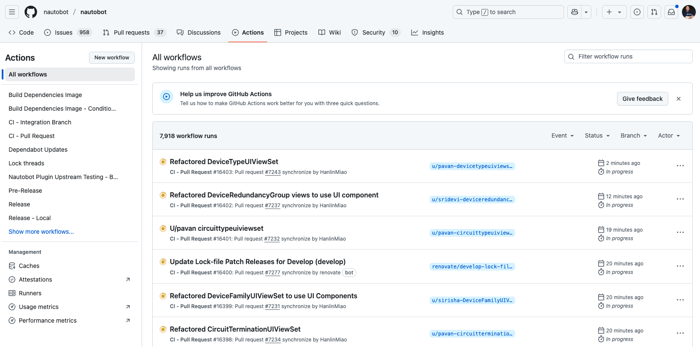

# Day 96: Nautobot Testing and Continuous Integration

## Objective
Understand the current practices for testing and continuous integration (CI) in Nautobot.

Please reference [Testing Nautobot](https://docs.nautobot.com/projects/core/en/stable/development/core/testing/) for best practices developing and maintaining Nautobot's automated test suites.

## Testing in Nautobot

Testing is a crucial part of software development. It helps ensure that the code works as expected and prevents bugs from being introduced. 

Nautobot follows certain best practices for writing and running tests.

### Key Components

1. **Unit Tests**: Test individual units of code to ensure they work as expected.
2. **Integration Tests**: Test the interaction between different units of code.
3. Tests of the UI/web browser functionality via Selenium
4. Tests for database migrations (upgrade scenarios)
5. Tests for generation and validation of the REST API and GraphQL schemas

### Nautobot Tests

1. **Use Django's Test Framework**:
   - Nautobot uses Django's built-in test framework.
   - Write tests in the `tests` directory of each app.

2. **Follow the Arrange-Act-Assert Pattern**:
   - Arrange: Set up the test data and environment.
   - Act: Execute the code being tested.
   - Assert: Verify the results.

3. **Use Factories for Test Data**:
   - Use factory libraries like `factory_boy` to create test data.
   - This helps keep the tests clean and maintainable.

4. **Write Test Cases for Different Scenarios**:
   - Write tests for both typical and edge cases.
   - Ensure that all possible scenarios are covered.

### Example: Unit Tests

Here is an example of a unit test in Nautobot:

1. **Create a Test File**:
   - Create a new file `test_models.py` in the `tests` directory of your app.

```python name=tests/test_models.py
from nautobot.core.testing.TestCase import TestCase
from nautobot.dcim.models import Device

class DeviceTestCase(TestCase):
    def setUp(self):
        self.device = Device.objects.create(name="Test Device")

    def test_device_creation(self):
        self.assertEqual(self.device.name, "Test Device")
```

2. **Run the Tests**:
   - Use Nautobot's `nautobot-server` to run the tests.

```sh
nautobot-server test <app_name>.<TestCaseClass>.<test_method>
```

## Continuous Integration (CI) in Nautobot

Continuous Integration (CI) is a development practice where developers integrate code into a shared repository frequently. Each integration is verified by an automated build and tests to detect issues early.

Nautobot uses GitHub Actions for CI. 



## Resources
- [Testing Nautobot](https://docs.nautobot.com/projects/core/en/stable/development/core/testing/)
- [Django Testing Documentation](https://docs.djangoproject.com/en/stable/topics/testing/)
- [GitHub Actions Documentation](https://docs.github.com/en/actions)
- [Nautobot Documentation](https://docs.nautobot.com/)

## Day 96 To Do

How's your project going? Feel free to post your progress on the project. 

You can also post what you have learned about testing from today's challenge on a social media of your choice, make sure you use the tag `#100DaysOfNautobot` `#JobsToBeDone` and tag `@networktocode`, so we can share your progress! 

In tomorrow's challenge, we will be highlighting community contributors and their recommendations for newcomers and veterans alike. See you tomorrow! 

[X/Twitter](<https://twitter.com/intent/tweet?url=https://github.com/nautobot/100-days-of-nautobot&text=I+jst+completed+Day+96+of+the+100+days+of+nautobot+challenge+!&hashtags=100DaysOfNautobot,JobsToBeDone>)

[LinkedIn](https://www.linkedin.com/) (Copy & Paste: I just completed Day 96 of 100 Days of Nautobot, https://github.com/nautobot/100-days-of-nautobot-challenge, challenge! @networktocode #JobsToBeDone #100DaysOfNautobot) 